# Navigation Flow Diagram - Crypto Presentation

## 🗺️ Complete Navigation Structure (22 Slides)



```mermaid
graph TD
    A[1. Intro] --> B[Hash Functions]
    
    B --> B1[2. hash-demo<br/>Demo & Blender]
    B1 --> B2[3. hash-avalanche<br/>Avalanche Effect]
    
    B2 --> C[Digital Signatures]
    
    C --> C1[4. signatures-1-keys<br/>Two-Key System]
    C1 --> C2[5. signatures-1-analogy<br/>Digital vs Traditional]
    C2 --> C3[6. signatures-1-security<br/>Mathematical Security]
    C3 --> C4[7. signatures-2-process<br/>Signing Process]
    C4 --> C5[8. signatures-2-verification<br/>Verification & Results]
    C5 --> C6[9. signatures-2-benefits<br/>Revolutionary Benefits]
    
    C6 --> D[Merkle Trees]
    
    D --> D1[10. merkle-1-problem<br/>The Problem]
    D1 --> D2[11. merkle-1-construction<br/>Building the Tree]
    D2 --> D3[12. merkle-1-steps<br/>How It Works]
    D3 --> D4[13. merkle-2-proof<br/>Proof of Inclusion]
    D4 --> D5[14. merkle-2-efficiency<br/>Efficiency Showcase]
    D5 --> D6[15. merkle-2-security<br/>Tamper Detection]
    
    D6 --> E[Blockchain]
    
    E --> E1[16. blockchain-1-signing<br/>Transactions & Merkle]
    E1 --> E2[17. blockchain-1-hashing<br/>Block Hashing]
    E2 --> E3[18. blockchain-1-linking<br/>Chain Linking]
    E3 --> E4[19. blockchain-2-attacks<br/>Attack Simulations]
    E4 --> E5[20. blockchain-2-security<br/>Security Guarantees]
    E5 --> E6[21. blockchain-2-trust<br/>Trust Model Revolution]
    
    style A fill:#e1f5fe
    style B1 fill:#fff3e0
    style B2 fill:#fff3e0
    style C1 fill:#f3e5f5
    style C2 fill:#f3e5f5
    style C3 fill:#f3e5f5
    style C4 fill:#f3e5f5
    style C5 fill:#f3e5f5
    style C6 fill:#f3e5f5
    style D1 fill:#e8f5e8
    style D2 fill:#e8f5e8
    style D3 fill:#e8f5e8
    style D4 fill:#e8f5e8
    style D5 fill:#e8f5e8
    style D6 fill:#e8f5e8
    style E1 fill:#fff8e1
    style E2 fill:#fff8e1
    style E3 fill:#fff8e1
    style E4 fill:#fff8e1
    style E5 fill:#fff8e1
    style E6 fill:#fff8e1
```

## 📊 Navigation Dots Visualization

```
Current (13 slides):
● ● ● ● ● ● ● ● ● ● ● ● ●

Proposed (22 slides):
● ●● ●●●●●● ●●●●●● ●●●●●●
↑  ↑     ↑       ↑       ↑
│  │     │       │       └─ Blockchain (6 slides)
│  │     │       └─ Merkle Trees (6 slides)  
│  │     └─ Digital Signatures (6 slides)
│  └─ Hash Functions (2 slides)
└─ Intro (1 slide)
```

## 🎯 Topic-Based Navigation Structure

### **🌟 Introduction** (1 slide)
- **Slide 1:** `intro` - Overview of all concepts

### **🌪️ Hash Functions** (2 slides)  
- **Slide 2:** `hash-demo` - The Digital Blender
- **Slide 3:** `hash-avalanche` - Avalanche Effect

### **🔐 Digital Signatures** (6 slides)
**Part 1: Fundamentals**
- **Slide 4:** `signatures-1-keys` - Two-Key System
- **Slide 5:** `signatures-1-analogy` - Digital vs Traditional  
- **Slide 6:** `signatures-1-security` - Mathematical Security

**Part 2: In Action**
- **Slide 7:** `signatures-2-process` - Signing Process (Steps 1-2)
- **Slide 8:** `signatures-2-verification` - Verification (Steps 3-4)
- **Slide 9:** `signatures-2-benefits` - Revolutionary Benefits

### **🌳 Merkle Trees** (6 slides)
**Part 1: Construction**
- **Slide 10:** `merkle-1-problem` - The Problem
- **Slide 11:** `merkle-1-construction` - Building the Tree
- **Slide 12:** `merkle-1-steps` - How It Works

**Part 2: Power**
- **Slide 13:** `merkle-2-proof` - Proof of Inclusion
- **Slide 14:** `merkle-2-efficiency` - Efficiency Showcase
- **Slide 15:** `merkle-2-security` - Tamper Detection

### **⛓️ Blockchain** (6 slides)
**Part 1: Assembly**
- **Slide 16:** `blockchain-1-signing` - Transactions & Merkle Trees
- **Slide 17:** `blockchain-1-hashing` - Block Hashing Process
- **Slide 18:** `blockchain-1-linking` - Chain Linking

**Part 2: Security**
- **Slide 19:** `blockchain-2-attacks` - Attack Simulations
- **Slide 20:** `blockchain-2-security` - Security Guarantees  
- **Slide 21:** `blockchain-2-trust` - Trust Model Revolution

## 🎮 Enhanced Navigation Features

### **Keyboard Shortcuts** (Proposed)
- `←/→` - Previous/Next slide
- `1-4` - Jump to topic start (Hash/Signatures/Merkle/Blockchain)
- `Home` - Jump to intro
- `End` - Jump to final slide

### **Visual Indicators**
- **Main Topic Dots:** Larger, colored by topic
- **Sub-slide Dots:** Smaller, semi-transparent
- **Current Position:** Highlighted with topic color
- **Progress Bar:** Shows overall presentation progress

### **Breadcrumb Navigation**
```
Crypto Fundamentals > Digital Signatures > Part 2 > Verification & Results
```

## 📱 Small Screen Benefits

### **Before (Current)**
- Dense slides with multiple concepts
- Overwhelming amount of information per screen
- Difficult to focus on specific elements

### **After (Proposed)**
- **Focused Content:** Each slide covers one specific concept
- **Digestible Chunks:** 3-4 key points maximum per slide
- **Logical Progression:** Clear story flow within each topic
- **Quick Navigation:** Jump directly to specific concepts
- **Better Engagement:** Animations focused on current content

## 🔄 User Journey Examples

### **Learning Hash Functions:**
1. `intro` → See hash function overview
2. `hash-demo` → Watch the digital blender in action
3. `hash-avalanche` → Understand why small changes matter

### **Understanding Digital Signatures:**
1. `signatures-1-keys` → Learn the two-key system
2. `signatures-1-analogy` → Compare to traditional signatures
3. `signatures-1-security` → See mathematical guarantees
4. `signatures-2-process` → Watch signing in action
5. `signatures-2-verification` → See verification process
6. `signatures-2-benefits` → Understand revolutionary impact

### **Quick Review Mode:**
- Jump directly to key concepts: slides 1, 3, 6, 9, 12, 15, 18, 21
- Get complete overview in 8 slides instead of 22

## 📈 Implementation Impact

- **Total Slides:** 13 → 22 (+69% more granular content)
- **Average Content per Slide:** Reduced by ~60%
- **Navigation Flexibility:** 4x more entry points
- **Small Screen Usability:** Significantly improved
- **Learning Curve:** Gentler progression through complex topics